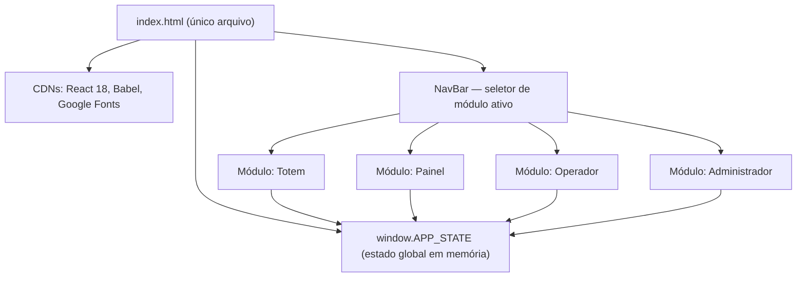
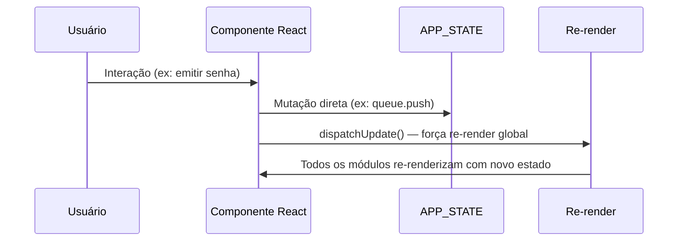

# Design Document — Password Queue System

## Overview

Sistema de gerenciamento de senhas para o setor BALCÃO, entregue como um único arquivo HTML auto-contido. A aplicação usa React 18 + Babel Standalone via CDN, sem backend, sem persistência externa. Todo o estado vive em um objeto JavaScript em memória (`window.APP_STATE`) compartilhado entre quatro módulos: Totem, Painel, Operador e Administrador.

Dois tipos de senha são suportados — Geral (G) e Preferencial (P) — diferenciados por cor e label, sem prefixo no número. O número da senha usa formato numérico com zero-padding de 3 dígitos (001–999), com ciclo contínuo por tipo.

### Decisões de Design

- **Arquivo único**: todo CSS, JS e HTML em um `.html`. Facilita distribuição e elimina dependências de servidor.
- **Estado em memória**: sem localStorage/sessionStorage. O estado é perdido ao recarregar — comportamento intencional para um sistema de atendimento diário.
- **React sem bundler**: Babel Standalone transpila JSX no browser. Adequado para a escala do projeto.
- **Sem biblioteca de estado**: `window.APP_STATE` + `forceUpdate` via `useState` é suficiente para a complexidade do sistema.
- **Dark theme obrigatório**: definido em variáveis CSS globais, aplicado a todos os módulos.

---

## Architecture

O sistema é uma SPA (Single Page Application) em arquivo único. A arquitetura segue um modelo de estado centralizado com renderização reativa manual.



### Fluxo de Atualização de Estado



`dispatchUpdate` é uma função global que chama o setter de um `useState` no componente raiz (`App`), forçando re-render de toda a árvore. Como o estado é um objeto mutável em `window`, não há necessidade de imutabilidade.

### CDNs Utilizadas

| Biblioteca | CDN | Versão |
|---|---|---|
| React | unpkg.com | 18.x |
| ReactDOM | unpkg.com | 18.x |
| Babel Standalone | unpkg.com | 7.x |
| Google Fonts | fonts.googleapis.com | — |

---

## Components and Interfaces

### Hierarquia de Componentes

```
App
├── NavBar
├── TotemModule
│   ├── ServiceButton (por tipo ativo)
│   └── TicketModal
├── PainelModule
│   ├── CurrentCallDisplay
│   ├── RecentCallsList
│   ├── QueueCounters
│   └── MediaCarousel
│       └── Slide
├── OperadorModule
│   ├── ServiceSummaryCard (por tipo)
│   ├── CallControls
│   ├── StationSelector
│   └── CallHistoryTable
└── AdminModule
    ├── DashboardTab
    │   └── HourlyChart
    ├── ServicesTab
    │   └── ServiceEditor
    ├── MediaTab
    │   └── SlideEditor
    ├── StationsTab
    │   └── StationEditor
    └── SettingsTab
        └── ResetControls
```

### Interfaces Principais

#### `dispatchUpdate()`
```js
// Função global que força re-render do App
window.dispatchUpdate = () => { /* chama setter do useState raiz */ }
```

#### `generateTicket(serviceId)`
```js
// Gera próxima senha para o serviceId informado
// Incrementa counter do service (ciclo 1–999)
// Retorna string com zero-padding: "001", "042", "999"
function generateTicket(serviceId): string
```

#### `callNext(stationId, serviceId?)`
```js
// Chama próxima senha da fila
// Se serviceId fornecido: chama do tipo específico
// Se não: respeita prioridade (maior priority primeiro, desempate por time)
// Atualiza queue, called, currentCall
function callNext(stationId: number, serviceId?: string): void
```

#### `repeatCall()`
```js
// Reemite currentCall sem alterar a fila
function repeatCall(): void
```

#### `exportHistory()`
```js
// Gera JSON com array de called e dispara download
function exportHistory(): void
```

---

## Data Models

### Estado Global (`window.APP_STATE`)

```js
{
  config: {
    unitName: string,        // Nome da unidade (ex: "UBS Central")
    sectorName: string,      // Nome do setor (ex: "BALCÃO")
    welcomeMessage: string,  // Mensagem no comprovante do Totem
    footerMessage: string,   // Mensagem no rodapé do Painel
    workingHours: string,    // Horário de funcionamento (ex: "08:00–17:00")
    pauseMediaOnCall: boolean // Pausar carrossel ao chamar senha
  },

  services: [
    {
      id: string,       // "general" | "priority"
      label: string,    // "Geral" | "Preferencial"
      color: string,    // Cor CSS (ex: "#3B82F6")
      active: boolean,
      counter: number,  // Contador atual (1–999, ciclo contínuo)
      priority: number  // Maior número = maior prioridade (ex: Preferencial=2, Geral=1)
    }
  ],

  stations: [
    {
      id: number,
      label: string,   // "Guichê 1", "Guichê 2", etc.
      active: boolean
    }
  ],

  queue: [
    {
      id: string,       // UUID gerado no momento da emissão
      ticket: string,   // "001", "042", etc.
      serviceId: string,
      time: number      // Date.now() no momento da emissão
    }
  ],

  called: [
    {
      ticket: string,
      serviceId: string,
      stationId: number,
      time: number      // Date.now() no momento da chamada
    }
  ],

  currentCall: {
    ticket: string,
    serviceId: string,
    stationId: number
  } | null,

  mediaItems: [
    {
      id: string,
      title: string,
      caption: string,
      url: string,           // URL da imagem (pode ser vazia)
      fallbackColor: string, // Cor CSS de fundo quando url inválida
      duration: number,      // Duração em segundos
      active: boolean,
      order: number          // Posição no carrossel (0-indexed)
    }
  ]
}
```

### Estado Inicial de Fábrica

```js
const FACTORY_STATE = {
  config: {
    unitName: "Unidade Central",
    sectorName: "BALCÃO",
    welcomeMessage: "Aguarde sua senha ser chamada.",
    footerMessage: "Obrigado pela preferência.",
    workingHours: "08:00–17:00",
    pauseMediaOnCall: true
  },
  services: [
    { id: "general",  label: "Geral",        color: "#3B82F6", active: true, counter: 0, priority: 1 },
    { id: "priority", label: "Preferencial", color: "#22C55E", active: true, counter: 0, priority: 2 }
  ],
  stations: [
    { id: 1, label: "Guichê 1", active: true },
    { id: 2, label: "Guichê 2", active: true },
    { id: 3, label: "Guichê 3", active: false }
  ],
  queue: [],
  called: [],
  currentCall: null,
  mediaItems: [
    { id: "m1", title: "Bem-vindo", caption: "Atendimento de qualidade", url: "", fallbackColor: "#1E3A5F", duration: 5, active: true, order: 0 },
    { id: "m2", title: "Horário",   caption: "08:00 às 17:00",           url: "", fallbackColor: "#1A3A2A", duration: 5, active: true, order: 1 }
  ]
}
```

### Geração de Ticket

O número da senha é gerado incrementando o `counter` do service:

```
nextCounter = (service.counter % 999) + 1
ticket = String(nextCounter).padStart(3, '0')
service.counter = nextCounter
```

Ciclo: 001 → 002 → ... → 999 → 001 → ...

### Regra de Prioridade na Chamada

```
1. Filtrar services com active=true e queue não vazia
2. Ordenar por priority DESC
3. Se empate em priority: pegar o item com menor time na fila
4. Remover da queue, adicionar em called, atualizar currentCall
```

---

## Correctness Properties

*A property is a characteristic or behavior that should hold true across all valid executions of a system — essentially, a formal statement about what the system should do. Properties serve as the bridge between human-readable specifications and machine-verifiable correctness guarantees.*


### Property 1: Ticket format — zero-padding e ciclo contínuo

*Para qualquer* valor de `counter` de um service (0 a 999), o ticket gerado deve ter exatamente 3 caracteres numéricos com zero-padding, e após o valor 999 o próximo ticket deve ser "001".

**Validates: Requirements 3.4**

### Property 2: Geração de senha aumenta a fila

*Para qualquer* serviceId ativo, chamar `generateTicket(serviceId)` deve aumentar `queue.length` em exatamente 1, e o ticket gerado deve estar presente na fila com o `serviceId` correto.

**Validates: Requirements 3.5**

### Property 3: Estimativa de espera cresce com a fila

*Para qualquer* fila com N senhas do mesmo tipo, adicionar mais uma senha deve resultar em uma estimativa de espera maior ou igual à anterior.

**Validates: Requirements 3.9**

### Property 4: Histórico recente limitado a 5 itens

*Para qualquer* sequência de chamadas de tamanho N, a lista de chamadas recentes exibida no Painel deve conter no máximo 5 itens.

**Validates: Requirements 4.4**

### Property 5: Chamar próxima respeita prioridade e atualiza estado

*Para qualquer* estado de fila com pelo menos um tipo ativo e não vazio, chamar `callNext(stationId)` deve: (a) selecionar o ticket do tipo com maior `priority`, (b) reduzir `queue.length` em 1, (c) aumentar `called.length` em 1, e (d) atualizar `currentCall` com o ticket chamado.

**Validates: Requirements 5.3, 5.4, 11.1, 11.3**

### Property 6: Chamar com fila vazia é operação nula

*Para qualquer* estado onde todas as filas estão vazias, chamar `callNext(stationId)` não deve alterar `queue`, `called` ou `currentCall`.

**Validates: Requirements 5.5**

### Property 7: Desempate de prioridade por tempo de emissão

*Para quaisquer* dois tickets de tipos com a mesma `priority`, `callNext` deve sempre selecionar o ticket com menor `time` (emitido primeiro).

**Validates: Requirements 11.2**

### Property 8: Nenhum ticket é chamado mais de uma vez da fila

*Para qualquer* sequência de N chamadas consecutivas a partir de uma fila com N tickets distintos, nenhum `ticket` deve aparecer mais de uma vez em `called`.

**Validates: Requirements 11.4**

### Property 9: Reset diário zera fila e contadores, preserva configurações

*Para qualquer* estado do sistema, após executar o reset diário: `queue` deve estar vazia, todos os `counter` dos services devem ser 0, e `config`, `services[].label`, `services[].color`, `services[].active`, `stations` e `mediaItems` devem permanecer inalterados.

**Validates: Requirements 10.3**

### Property 10: Reset completo restaura estado de fábrica

*Para qualquer* estado do sistema (independente de quantas operações foram realizadas), após executar o reset completo, o `APP_STATE` deve ser estruturalmente igual ao `FACTORY_STATE`.

**Validates: Requirements 10.4**

### Property 11: Exportação de histórico contém campos obrigatórios

*Para qualquer* array `called` com N entradas, o JSON exportado deve ser um array de N objetos onde cada objeto contém exatamente os campos `ticket`, `serviceId`, `stationId` e `time`.

**Validates: Requirements 10.5, 10.6**

### Property 12: Toggle de active é reversível

*Para qualquer* service, alternar `active` de `true` para `false` e de volta para `true` deve resultar no mesmo estado original do service.

**Validates: Requirements 7.2**

### Property 13: Contagem de guichês corresponde ao total configurado

*Para qualquer* número N entre 1 e 20, após definir o total de guichês como N, `stations.length` deve ser exatamente N.

**Validates: Requirements 9.2**

---

## Error Handling

### Ticket Generation

- Se `serviceId` não existir em `services`, `generateTicket` não deve alterar o estado e deve retornar `null`.
- Se o service estiver inativo (`active: false`), a geração deve ser bloqueada.

### Call Operations

- Se `stationId` não existir ou estiver inativo, `callNext` deve ser bloqueado.
- Se `serviceId` específico for passado mas a fila daquele tipo estiver vazia, a operação retorna sem alterar o estado.

### Media Carousel

- Se `url` de um Slide for inválida (erro de carregamento de imagem), o componente deve capturar o evento `onError` e exibir `fallbackColor` como fundo.
- Se não houver Slides ativos, o Carrossel não deve renderizar e não deve causar erros.

### Admin Operations

- Reset Diário requer confirmação única (`window.confirm` ou modal).
- Reset Completo requer confirmação dupla (dois `window.confirm` ou modal com campo de digitação).
- Exportar Histórico com `called` vazio deve gerar um arquivo JSON com array vazio `[]`.

### Station Management

- Reduzir o número de guichês abaixo do total atual deve remover os guichês de maior `id` primeiro.
- Não é permitido ter 0 guichês (mínimo: 1).

---

## Testing Strategy

### Abordagem Dual

O sistema usa dois tipos complementares de teste:

- **Testes unitários (exemplos)**: verificam comportamentos específicos, casos de borda e condições de erro com entradas fixas.
- **Testes de propriedade (property-based)**: verificam propriedades universais com entradas geradas aleatoriamente, cobrindo o espaço de inputs de forma abrangente.

### Biblioteca de Property-Based Testing

Para JavaScript/browser: **[fast-check](https://github.com/dubzzz/fast-check)** (npm: `fast-check`).

```js
import fc from 'fast-check'

// Exemplo de estrutura de teste de propriedade
fc.assert(
  fc.property(
    fc.integer({ min: 0, max: 999 }), // counter arbitrário
    (counter) => {
      const ticket = generateTicketFromCounter(counter)
      return ticket.length === 3 && /^\d{3}$/.test(ticket)
    }
  ),
  { numRuns: 100 }
)
```

### Configuração

- Mínimo de **100 iterações** por teste de propriedade (`numRuns: 100`).
- Cada teste de propriedade deve referenciar a propriedade do design com o formato:
  `// Feature: password-queue-system, Property N: <texto da propriedade>`

### Testes Unitários (Exemplos)

Focados em:
- Estado inicial contém todas as entidades obrigatórias (Requirement 1.2, 1.3)
- Modal de comprovante exibe todos os campos obrigatórios (Requirement 3.6)
- Painel exibe currentCall em destaque quando não nulo (Requirement 4.2)
- Operador exibe indicador de fila vazia quando queue está vazia (Requirement 5.5, 12.6)
- Exportar histórico vazio gera `[]` (Requirement 10.6 — edge case)

### Testes de Propriedade

Cada propriedade do design deve ser implementada por **um único teste de propriedade**:

| Propriedade | Geradores fast-check |
|---|---|
| P1: Ticket format | `fc.integer({ min: 0, max: 999 })` |
| P2: Queue grows | `fc.constantFrom('general', 'priority')` |
| P3: Wait estimate | `fc.array(fc.record({...}), { minLength: 0, maxLength: 50 })` |
| P4: Recent calls cap | `fc.array(fc.record({...}), { minLength: 0, maxLength: 100 })` |
| P5: Call next priority | `fc.record({ queue: fc.array(...), services: fc.array(...) })` |
| P6: Empty queue no-op | Estado com queue vazia |
| P7: Tie-breaking by time | Dois tickets com mesma priority, times distintos |
| P8: No duplicate calls | `fc.array` de tickets únicos |
| P9: Daily reset | Estado arbitrário completo |
| P10: Full reset | Estado arbitrário completo |
| P11: Export fields | `fc.array(fc.record({ ticket, serviceId, stationId, time }))` |
| P12: Toggle reversible | `fc.boolean()` para active inicial |
| P13: Station count | `fc.integer({ min: 1, max: 20 })` |

### Cobertura de Casos de Borda

Os geradores devem incluir casos de borda naturalmente:
- Fila vazia (array de tamanho 0)
- Counter em 999 (ciclo para 001)
- Todos os services inativos
- Todos os guichês inativos
- mediaItems com url vazia
- called com 0 entradas (exportação)
